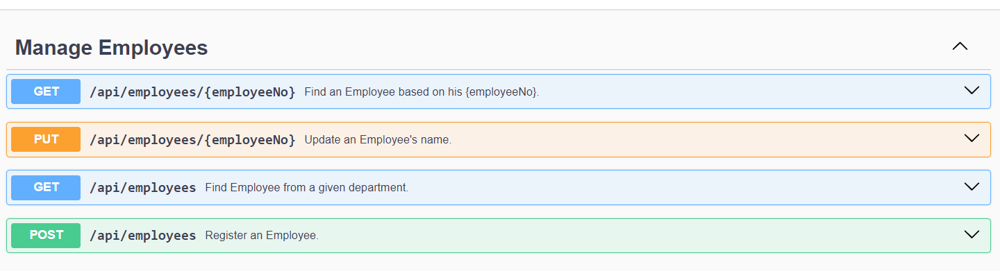
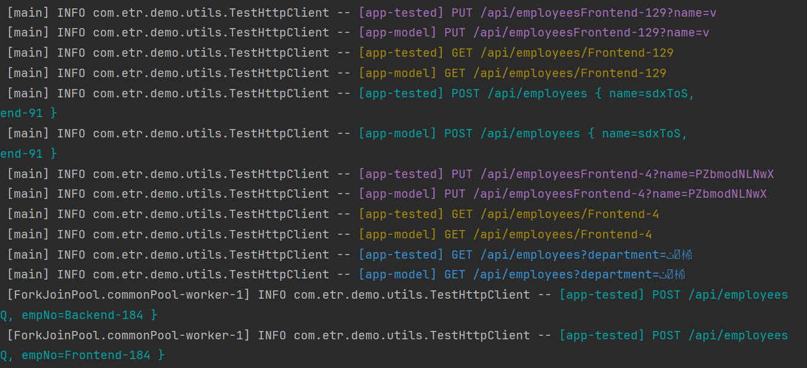

# Model-Based Testing with Testcontainers and Jqwik

In this demo, we'll explore the Model-based testing technique to perform regression testing on a simple REST
API.

We'll use the [Jqwik](https://jqwik.net) test engine on JUnit5 to run Property and Model-based tests. Additionally, we'll use
[Testcontainers](https://testcontainers.com/getting-started/) to spin up Docker containers with different versions of our application.

## 1. Model-Based Testing

Model-Based Testing (MBT) is a method for testing stateful software by comparing the tested component with a "model" that represents the expected behavior of the system. Instead of manually writing test cases, we'll use a testing tool that:

- Takes a list of possible actions supported by the application,
- Automatically generates test sequences from these actions, targeting potential edge cases,
- Executes these tests on the software and the model, comparing the results.

In our case, the "actions" are simply the endpoints exposed by the application's API. For the demo's code examples, we'll use a basic service with a CRUD REST API that allows us to:

- Find an employee by its unique "Employee Number"
- Update an employee's name
- Get a list of all the employees from a "department"
- Register a new employee



Once everything is configured and we finally run the test, we can expect to see a rapid sequence of hundreds of requests being sent to the two stateful services:



## 2. Docker Compose

Let’s assume we need to switch the database from Postgres to MySQL and want to ensure the service’s behavior remains consistent. To test this, we can run both versions of the application, send identical requests to each, and compare the responses. 

We can set up the environment using a Docker Compose that will run two versions of the app: 
- the **model** (`mbt-demo:postgres`): the current _live_ version and our source of truth,
- the **tested** version (`mbt-demo:mysql`): the new _feature branch_ that is under test.


```yaml
services:
  ## MODEL
  app-model:
    image: mbt-demo:postgres
    # ...
    depends_on:
      - postgres
  postgres:
    image: postgres:16-alpine
    # ...
      
  ## TESTED
  app-tested:
    image: mbt-demo:mysql
    # ...
    depends_on:
      - mysql
  mysql:
    image: mysql:8.0
    # ...
```

## 3. Testcontainers

At this point, we could start the application and databases manually for testing, but this would be tedious. Instead, let's use Testcontainers' [`ComposeContainer`](https://java.testcontainers.org/modules/docker_compose/) to automate this with our Docker Compose file during the testing phase.

In this example, we'll use Jqwik as our JUnit 5 test runner. Firstly, let's add the [Jqwik](https://mvnrepository.com/artifact/net.jqwik/jqwik) and [Testcontainers](https://mvnrepository.com/artifact/org.testcontainers/testcontainers), and the [jqwik-testcontainers](https://mvnrepository.com/artifact/net.jqwik/jqwik-testcontainers) dependencies to our _pom.xml_:

```xml
<dependency>
    <groupId>net.jqwik</groupId>
    <artifactId>jqwik</artifactId>
    <version>1.9.0</version>
    <scope>test</scope>
</dependency>
<dependency>
    <groupId>net.jqwik</groupId>
    <artifactId>jqwik-testcontainers</artifactId>
    <version>0.5.2</version>
    <scope>test</scope>
</dependency>
<dependency>
    <groupId>org.testcontainers</groupId>
    <artifactId>testcontainers</artifactId>
    <version>1.20.1</version>
    <scope>test</scope>
</dependency>
```

As a result, we can now instantiate a _ComposeContainer_ and pass our test _docker-compose_ file as argument:

```java
@Testcontainers
class ModelBasedTest {

    @Container
    static ComposeContainer ENV = new ComposeContainer(new File("src/test/resources/docker-compose-test.yml"))
       .withExposedService("app-tested", 8080, Wait.forHttp("/api/employees").forStatusCode(200))
       .withExposedService("app-model", 8080, Wait.forHttp("/api/employees").forStatusCode(200));

    // tests
}
```

## 4. Test Http Client

Now let's create a small test utility that will help us execute the HTTP requests against our services:

```java
class TestHttpClient {
  ApiResponse<EmployeeDto> get(String employeeNo) { /* ... */ }
  
  ApiResponse<Void> put(String employeeNo, String newName) { /* ... */ }
  
  ApiResponse<List<EmployeeDto>> getByDepartment(String department) { /* ... */ }
  
  ApiResponse<EmployeeDto> post(String employeeNo, String name) { /* ... */ }

    
  record ApiResponse<T>(int statusCode, @Nullable T body) { }
    
  record EmployeeDto(String employeeNo, String name) { }
}
```

Additionally, in the test class we can declare another method that helps us create _TestHttpClient_s for the two services started by the _ComposeContainer_:

```java
static TestHttpClient testClient(String service) {
  int port = ENV.getServicePort(service, 8080);
  String url = "http://localhost:%s/api/employees".formatted(port);
  return new TestHttpClient(service, url);
}
```

This will make it easy to create two test clients in our test, one for each version of the service:

```java
TestHttpClient model = testClient("app-model");
TestHttpClient tested = testClient("app-tested");
```

## 5. Jqwik

Jqwik is a property-based testing framework for Java that integrates with JUnit5, automatically generating test cases to validate properties of code across diverse inputs. It enhances test coverage and uncovers edge cases by using generators to create varied and random test inputs.

If you're new to Jqwik, you can explore their API in detail by reviewing the [official user guide](https://jqwik.net/docs/current/user-guide.html). While this tutorial won't cover all the specifics of  the API, it's important to know that Jqwik allows us to define a set of actions we want to test.

To begin with, we’ll use Jqwik’s _@Property_ annotation to define a test - instead of the traditional _@Test_:
```java
@Property
void regressionTest() {
  TestHttpClient model = testClient("app-model");
  TestHttpClient tested = testClient("app-tested");
  // ...
}

```

Next, we’ll define the "actions", which are the HTTP calls to our APIs and can also include assertions. 

For instance, the _GetOneEmployeeAction_ will try to fetch a specific employee from both services and compare the responses:

```java
record ModelVsTested(TestHttpClient model, TestHttpClient tested) {}

record GetOneEmployeeAction(String empNo) implements Action<ModelVsTested> {
  @Override
  public ModelVsTested run(ModelVsTested apps) {
    ApiResponse<EmployeeDto> actual = apps.tested.get(empNo);
    ApiResponse<EmployeeDto> expected = apps.model.get(empNo);

    assertThat(actual)
      .satisfies(hasStatusCode(expected.statusCode()))
      .satisfies(hasBody(expected.body()));
    return apps;
  }
}
```

Additionally, we'll need to wrap these *Action*s within _Arbitrary_ objects. We can think of _Arbitraries_ as of objects implementing the factory design pattern, that can generate a wide variety of instances of a type, based on a set of configured rules. 

For instance, the _Arbitrary<String>_ returned by _employeeNos()_ can generate employee numbers by choosing a random department from the configured list and concatenating a number between 0 and 200:

```java
static Arbitrary<String> employeeNos() {
  Arbitrary<String> departments = Arbitraries.of("Frontend", "Backend", "HR", "Creative", "DevOps");
  Arbitrary<Long> ids = Arbitraries.longs().between(1, 200);
  return Combinators.combine(departments, ids).as("%s-%s"::formatted);
}
```

Similarly, _getOneEmployeeAction()_ returns an _Aribtrary_ action based on a given _Arbitrary_ employee number:  

```java
static Arbitrary<GetOneEmployeeAction> getOneEmployeeAction() {
  return employeeNos().map(GetOneEmployeeAction::new);
}
```

After declaring all the other _Actions_ and _Arbitraries_, we'll create an _ActionSequence_:

```java
@Provide
Arbitrary<ActionSequence<ModelVsTested>> mbtJqwikActions() {
  return Arbitraries.sequences(
    Arbitraries.oneOf(
      MbtJqwikActions.getOneEmployeeAction(),
      MbtJqwikActions.getEmployeesByDepartmentAction(),
      MbtJqwikActions.createEmployeeAction(),
      MbtJqwikActions.updateEmployeeNameAction()
  ));
}

static Arbitrary<Action<ModelVsTested>> getOneEmployeeAction() { /* ... */ }
static Arbitrary<Action<ModelVsTested>> getEmployeesByDepartmentAction() { /* ... */ }
// same for the other actions
```
Now we can write our test and leverage Jqwik to use the provided actions to test various sequences. Let's create the _ModelVsTested_ tuple, and use it to execute the sequence of actions against it:

```java
@Property
void regressionTest(@ForAll("mbtJqwikActions") ActionSequence<ModelVsTested> actions) {
  ModelVsTested testVsModel = new ModelVsTested(
    testClient("app-model"),
    testClient("app-tested")
  );
  actions.run(testVsModel);
}
```
 
That's it, we can finally run the test! This will generate a sequence of thousands of requests trying to find inconsistencies between the model and the tested service:

```
INFO com.etr.demo.utils.TestHttpClient -- [app-tested] PUT /api/employeesFrontend-129?name=v
INFO com.etr.demo.utils.TestHttpClient -- [app-model] PUT /api/employeesFrontend-129?name=v
INFO com.etr.demo.utils.TestHttpClient -- [app-tested] GET /api/employees/Frontend-129
INFO com.etr.demo.utils.TestHttpClient -- [app-model] GET /api/employees/Frontend-129
INFO com.etr.demo.utils.TestHttpClient -- [app-tested] POST /api/employees { name=sdxToS, empNo=Frontend-91 }
INFO com.etr.demo.utils.TestHttpClient -- [app-model] POST /api/employees { name=sdxToS, empNo=Frontend-91 }
INFO com.etr.demo.utils.TestHttpClient -- [app-tested] PUT /api/employeesFrontend-4?name=PZbmodNLNwX
INFO com.etr.demo.utils.TestHttpClient -- [app-model] PUT /api/employeesFrontend-4?name=PZbmodNLNwX
INFO com.etr.demo.utils.TestHttpClient -- [app-tested] GET /api/employees/Frontend-4
INFO com.etr.demo.utils.TestHttpClient -- [app-model] GET /api/employees/Frontend-4
INFO com.etr.demo.utils.TestHttpClient -- [app-tested] GET /api/employees?department=ٺ⯟桸
INFO com.etr.demo.utils.TestHttpClient -- [app-model] GET /api/employees?department=ٺ⯟桸
        ...
```

## 6. Catching Errors

If we run the test and check the logs, we’ll quickly spot a failure. It appears that when searching for employees by department with the argument `ٺ⯟桸` the model produces an internal server error, while the test version returns 200 OK:

```text
Original Sample
---------------
actions:
ActionSequence[FAILED]: 8 actions run [
    UpdateEmployeeAction[empNo=Creative-13, newName=uRhplM],
    CreateEmployeeAction[empNo=Backend-184, name=aGAYQ],
    UpdateEmployeeAction[empNo=Backend-3, newName=aWCxzg],
    UpdateEmployeeAction[empNo=Frontend-93, newName=SrJTVwMvpy],
    UpdateEmployeeAction[empNo=Frontend-129, newName=v],
    CreateEmployeeAction[empNo=Frontend-91, name=sdxToS],
    UpdateEmployeeAction[empNo=Frontend-4, newName=PZbmodNLNwX],
    GetEmployeesByDepartmentAction[department=ٺ⯟桸]
]
    final currentModel: ModelVsTested[model=com.etr.demo.utils.TestHttpClient@5dc0ff7d, tested=com.etr.demo.utils.TestHttpClient@64920dc2]
Multiple Failures (1 failure)
    -- failure 1 --
    expected: 200
    but was: 500
```

Upon investigation, we find that the issue arises from a native SQL query using Postgres-specific syntax to retrieve data. While this was a simple issue in our small application, model-based testing can help uncover unexpected behavior that may only surface after a specific sequence of repetitive steps pushes the system into a particular state.

## 7. Conclusion

In this demo, we explored Property and Model-Based Testing to write a regression test for our REST API. We ran two versions of our application: the model (the current live version) and the tested version (built from a feature branch with structural changes).

Using Testcontainers and Docker Compose, we quickly set up both versions and their dependencies. We then created a simple HTTP client and mapped our REST API endpoints to Jqwik actions. Finally, Jqwik generated hundreds of requests with varied payloads, targeting both versions and focusing on edge cases to find inconsistencies.

